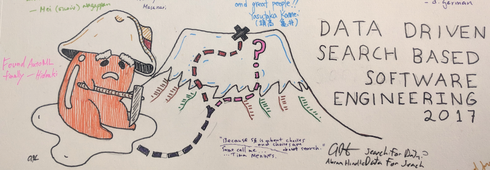

[home](http://tiny.cc/sbse) |
[models](MODELS.md) |
[data](DATA.md) |
[discuss](https://github.com/ai-se/ResourcesDataDrivenSBSE/issues) |
[citation](CITATION.md) |
[copyright](https://github.com/ai-se/ResourcesDataDrivenSBSE/blob/master/LICENSE.md) &copy;2018 
 
  

 

The recent seminar
Data-Driven Search-Based SE (https://goo.gl/f8D3EC) concluded that 
(1) the  mining software repositories can be improved using search-based methods; and that (2) search-based methods can be improved using
  tools from the MSR community. 
  
  The resources of this
  repository are intended to encourage more experimentation
  in these two directions.

## Resources:

References in the _related work_ column come from the paper http://tiny.cc/ddSbse1.

## How to Contribute

Please clone this [repo](https://github.com/ai-se/ResourcesDataDrivenSBSE), then make
 some changes, then post a pull request. Remember, the more the merrier!
