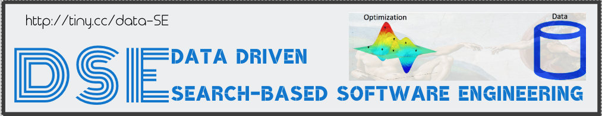

[home](http://tiny.cc/sbse) |
[copyright](https://github.com/ai-se/ResourcesDataDrivenSBSE/blob/master/LICENSE.md) &copy;2018 
 
  
[models](xx) |
[data](xx) |
[discuss](https://github.com/ai-se/ResourcesDataDrivenSBSE/issues)

 

Premise:

- mining software repositories can be improved using search-based methods;
- search-based methods can be improved using
  tools from the MSR community.

## Resources:

References in the _related work_ column come from the paper http://tiny.cc/ddSbse1.

## How to Contribute

Please clone this repo, propose some changes, then post a pull request. Remember, the more the merrier!
